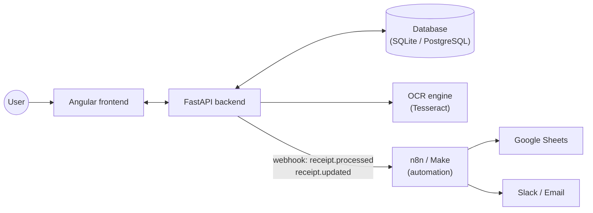
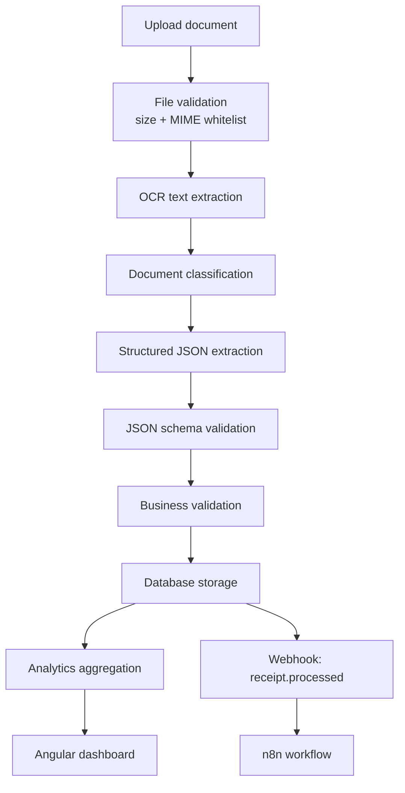
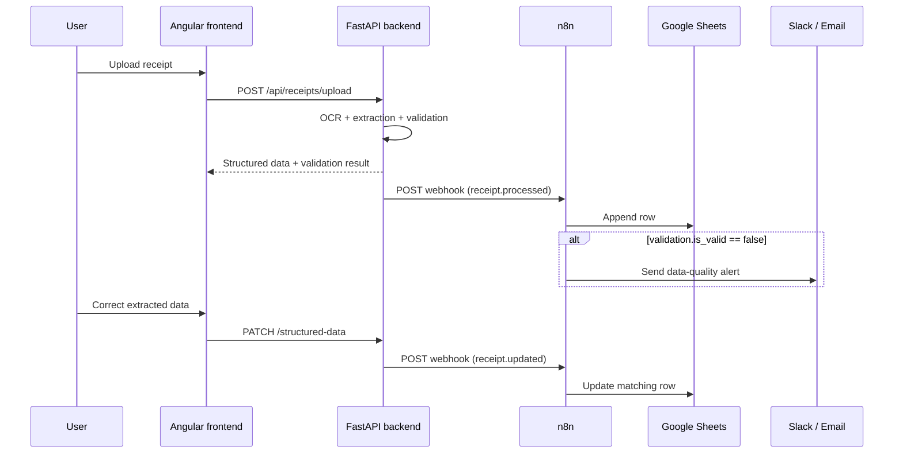

# Smart Receipt Analyzer

**Live demo:** [frontend](https://smart-receipt-frontend-fwi4.onrender.com) · [backend API docs](https://smart-receipt-backend.onrender.com/docs)
*(hosted on Render's free tier — the first request after a period of inactivity can take 30-60s to wake up)*

Smart Receipt Analyzer is a full-stack AI and data analytics project that extracts, structures, validates and analyzes receipt data from uploaded documents.

The goal of this project is to demonstrate a complete engineering workflow:

- OCR document processing
- Structured JSON extraction
- Business validation
- Backend API with FastAPI
- Frontend dashboard with Angular
- Analytics and data visualization
- Unit testing
- Clean project architecture

---

## Project overview

Users can upload a receipt image or PDF. The backend extracts the raw text, classifies the document, converts the content into structured JSON, validates the extracted data, stores the result, and exposes analytics endpoints.

The frontend displays the processed receipts and provides an analytics workspace with KPIs, spending trends, category distribution, merchant ranking, product analysis and data quality indicators.

---

## Main features

### Receipt processing

- Upload receipt image or PDF
- Validate uploaded file format
- Extract raw text with OCR
- Classify document type
- Extract structured receipt data
- Validate extracted JSON
- Store receipt data in database
- Review and correct extracted information

### Analytics

- Total spending
- Number of receipts
- Average basket
- Top merchant
- Top category
- Monthly spending trend
- Category distribution
- Merchant ranking
- Product-level analysis
- Data quality score
- Dynamic filter options

### Frontend

- Modern Angular interface
- Dashboard page
- Receipts list
- Receipt detail page
- Human review page
- Analytics workspace
- Responsive UI

### Backend

- FastAPI REST API
- SQLAlchemy models
- Repository/service architecture
- OCR service layer
- Business validation layer
- Analytics service layer
- Unit tests with pytest

---

## Tech stack

### Backend

- Python
- FastAPI
- SQLAlchemy
- Pydantic
- PostgreSQL or SQLite
- Pytest
- OCR engine: Tesseract / future OCR engines

### Frontend

- Angular
- TypeScript
- HTML
- CSS
- Standalone components

---

## Architecture

```text
smart-receipt-analyzer/
│
├── backend/
│   ├── app/
│   │   ├── api/
│   │   │   └── routes/
│   │   ├── db/
│   │   ├── models/
│   │   ├── repositories/
│   │   ├── schemas/
│   │   ├── services/
│   │   │   ├── ocr/
│   │   │   ├── analytics_service.py
│   │   │   ├── business_validation_service.py
│   │   │   ├── classification_service.py
│   │   │   └── extraction_service.py
│   │   └── main.py
│   │
│   └── app/tests/
│
├── frontend/
│   └── src/app/
│       ├── core/
│       ├── pages/
│       └── shared/
│
└── README.md

---

## System overview



---

## Data pipeline



---

## Automation flow (n8n / Make)



--- 

## Backend API 

### Endpoints

**Health**

- `GET /api/health`: Health check

**Receipt endpoints**

- `POST /api/receipts/upload`: Upload a receipt image or PDF
- `GET /api/receipts?skip=0&limit=20`: Get a paginated list of receipts (`{ items, total, skip, limit }`)
- `GET /api/receipts/{id}`: Get a specific receipt
- `PATCH /api/receipts/{receipt_id}/structured-data`: Update structured data
- `DELETE /api/receipts/{id}`: Delete a receipt

**Analytics endpoints**

- `GET /api/analytics/summary`: Get overall analytics summary
- `GET /api/analytics/document-types`: Get document type distribution
- `GET /api/analytics/validation`: Get validation statistics
- `GET /api/analytics/charts`: Get chart data for visualizations
- `GET /api/analytics/merchant-spending`: Get merchant spending
- `GET /api/analytics/monthly-spending`: Get monthly spending
- `GET /api/analytics/top-products`: Get top products
- `GET /api/analytics/category-spending`: Get category spending
- `GET /api/analytics/insights`: Get detailed analytics insights

## Analytics layer
The project includes a dedicated analytics layer that transforms OCR-extracted receipt data into business insights.
Tested analytics features :
- Merchant spending aggregation
- Monthly spending trends
- Category-level spending distribution
- Product ranking by total spending
- Filter option generation
- Data quality scoring

---

Run analytics tests:
``` bash
cd backend
pytest app/tests/test_services_analytics.py -v 
```

## n8n integration

The backend can notify an external automation tool (n8n, Make, or any webhook receiver) every time a receipt is successfully processed. This lets you build notifications, spreadsheet syncing, or data-quality alerts without touching the backend code.

### Configuration

Set the following in `backend/.env`:

```env
WEBHOOK_ENABLED=true
WEBHOOK_URL=https://your-n8n-instance/webhook/receipt-processed
```

When disabled (default), the upload flow behaves exactly as before — the webhook call is entirely skipped.

### Event payload

On every successful upload, a `receipt.processed` event is POSTed as JSON:

```json
{
  "event": "receipt.processed",
  "receipt_id": 42,
  "document_type": "receipt",
  "structured_data": { "merchant_name": "LIDL", "total_amount": 23.4, "items": [ /* ... */ ] },
  "validation": { "is_valid": true, "errors": [], "warnings": [] }
}
```

The webhook call is fire-and-forget: a slow or unreachable endpoint is logged as a warning and never breaks the upload response for the user.

### Running n8n

The `docker-compose.yml` at the repo root already includes an `n8n` service, wired so the backend container can reach it at `http://n8n:5678` on the Docker network. Just run:

```bash
docker compose up
```

n8n will be available at `http://localhost:5678`. To activate the webhook call from the backend container, create a `.env` file next to `docker-compose.yml` with `WEBHOOK_ENABLED=true` (it defaults to `false`).

Alternatively, to run n8n standalone (outside Docker Compose): `docker run -it --rm --name n8n -p 5678:5678 -v n8n_data:/home/node/.n8n docker.n8n.io/n8nio/n8n`

### Building the n8n workflow

1. Open n8n (see above)
2. Create a workflow starting with a **Webhook** node (trigger), method `POST`.
3. Use the **Test URL** during development (only active while "Listen for test event" is running), point `WEBHOOK_URL` to it, and upload a receipt to see the payload land in n8n.
4. Add an **IF** node checking `validation.warnings.length > 0` or `validation.is_valid == false` to branch between a data-quality alert (Slack/Email) and the happy path (e.g. Google Sheets "Append Row" mapped to `merchant_name`, `total_amount`, `purchase_date`).
5. Activate the workflow and switch `WEBHOOK_URL` to the **Production URL**.

The same payload works identically with Make — only the workflow-building UI differs.

## Run the project locally
1. Backend
``` bash
cd backend
python -m venv .venv
source .venv/bin/activate
pip install -r requirements.txt
uvicorn app.main:app --reload
```

Backend runs on:
- `http://127.0.0.1:8000`
API documentation:
- `http://127.0.0.1:8000/docs`

2. Frontend
``` bash
cd frontend
npm install 
ng serve 
```

Frontend runs on:
```http://localhost:4200```

---

## Deploy a public demo

The repo is ready to deploy as-is on [Render](https://render.com) using the `render.yaml` Blueprint at the repo root — no code changes needed, only account setup and a few clicks. See the [live demo](#smart-receipt-analyzer) above for a real example of this deployment.

### How it works

- `frontend/nginx.conf.template` uses a `${BACKEND_URL}` placeholder, filled in at container startup by nginx's built-in `envsubst` templating (no rebuild needed to point the frontend at a different backend URL).
- The backend's allowed CORS origins are read from the `ALLOWED_ORIGINS` env var (comma-separated), instead of being hardcoded.
- `DATABASE_URL` is normalized from Render/Heroku's `postgres://` scheme to the `postgresql://` scheme SQLAlchemy expects.

### Steps (Render)

1. Push this repo to GitHub (if not already).
2. Create a free [Render](https://render.com) account and connect your GitHub account.
3. In the Render dashboard: **New → Blueprint**, select this repo. Render reads `render.yaml` and proposes 3 resources: `smart-receipt-backend`, `smart-receipt-frontend`, `smart-receipt-db` (free Postgres).
4. Click **Apply** — Render builds both Docker images and provisions the database.
5. Once deployed, note the actual URLs Render assigned (e.g. `https://smart-receipt-backend-xxxx.onrender.com`) — Render appends a random suffix if the exact name from `render.yaml` is already taken globally. If they differ from the defaults (`smart-receipt-backend.onrender.com` / `smart-receipt-frontend.onrender.com`), update the `ALLOWED_ORIGINS` env var on the backend service and the `BACKEND_URL` env var on the frontend service in the Render dashboard to match, then let Render redeploy.
6. Open the frontend URL — you should get a working demo end-to-end.

### Known limitations of the free tier

- Free web services on Render spin down after inactivity; the first request after idling can take ~30-60s to wake up.
- Uploaded receipt files are stored on local container disk (`backend/uploads/`) — on a free/ephemeral instance this storage does **not** persist across redeploys. The database (Postgres, managed separately) does persist. For a fully durable demo, add a Render persistent disk or swap `file_service.py` to an S3-compatible bucket.
- The n8n webhook integration is disabled by default (`WEBHOOK_ENABLED=false`) — it targets a local n8n instance and isn't part of this deployment. To wire it up in production, run n8n separately (e.g. n8n Cloud, or a separate Render/VPS deployment) and point `WEBHOOK_URL` at it.
- Free-tier CPU is heavily throttled: OCR on a real phone photo that takes ~1s locally was measured taking 7+ minutes on Render's free plan. Uploads are processed asynchronously for exactly this reason (see below) — without that, the reverse proxy's gateway timeout would turn a slow-but-successful upload into a client-facing `502`/`504`.

### Real gotchas we hit deploying this (already fixed in this repo)

**nginx proxying to an HTTPS upstream by hostname (`502 Bad Gateway`)**

When `BACKEND_URL` points to an **HTTPS** host (as it does on Render, vs. plain HTTP in local Docker Compose), nginx needs two extra directives to correctly reverse-proxy to it:

```nginx
proxy_ssl_server_name on;        # sends the correct SNI during the TLS handshake
proxy_set_header Host $proxy_host;  # forwards the upstream's own hostname, not the frontend's
```

Without `proxy_ssl_server_name on`, Cloudflare (which fronts Render) can't route the TLS connection correctly. Without the corrected `Host` header, requests fail because they carry the *frontend's* hostname while trying to reach the *backend's*. Both are already set in [`frontend/nginx.conf.template`](frontend/nginx.conf.template).

**OCR is too slow for a synchronous request/response cycle on constrained hosting**

`POST /api/receipts/upload` returns `202 Accepted` immediately with `processing_status: "pending"`; OCR, classification, extraction and validation run in a `BackgroundTask` afterward. The frontend polls `GET /api/receipts/{id}` every few seconds until the status is no longer `"pending"`. See [`receipt_processing_service.py`](backend/app/services/receipt_processing_service.py) and the polling logic in [`receipt-detail.ts`](frontend/src/app/pages/receipt-detail/receipt-detail.ts).

Two smaller mitigations ride along with this:
- Images above 4000px on the longest side are downscaled before OCR (a pure safety net for oversized photos — testing showed overly aggressive downscaling can flip character recognition, e.g. "Carrefour" → "Garrefour", so this is deliberately generous rather than tuned for speed).
- New columns (`processing_status`, `error_message`) are added to the `receipts` table via a small in-code migration ([`run_lightweight_migrations()`](backend/app/db/database.py)) rather than a full migration tool — enough for a project of this size, since `Base.metadata.create_all()` alone only creates missing tables, not missing columns on existing ones.

---

## Roadmap / possible next steps

- **User accounts & authentication** — the app is currently single-tenant (no login, all receipts are shared/global). Adding JWT-based auth with per-user data isolation and personalized analytics would be a natural next step, but is a substantial change (user model, data migration, per-endpoint filtering, frontend guards) — intentionally left out for now to keep the current focus on the OCR/analytics/automation pipeline.
- CSV/PDF export of analytics
- Additional hand-tuned merchant parsers (currently 4 dedicated + 4 generic-parser merchants)
- Persistent file storage (S3-compatible) for a fully durable free-tier deployment

---

## Why this project matters
This project demonstrates practical full-stack engineering skills:
- Building a REST API with FastAPI
- Structuring a backend with services, repositories and schemas
- Processing real-world unstructured documents
- Transforming OCR output into structured data
- Validating data quality
- Creating analytics-ready endpoints
- Building a modern Angular frontend
- Writing unit tests for business logic

It combines software engineering, AI document processing and data analytics in one complete portfolio project.

---
## Continuous integration

The backend test suite is automatically executed with GitHub Actions on every push and pull request.

The CI pipeline checks:

- Python dependency installation
- OCR system dependency installation
- Backend unit tests
- Analytics service tests

Workflow file:

```text
.github/workflows/backend-ci.yml

The frontend build is also checked automatically with GitHub Actions.

Frontend CI checks:

- Node.js dependency installation
- Angular unit tests (Vitest)
- Angular production build

Workflow file:

```text
.github/workflows/frontend-ci.yml